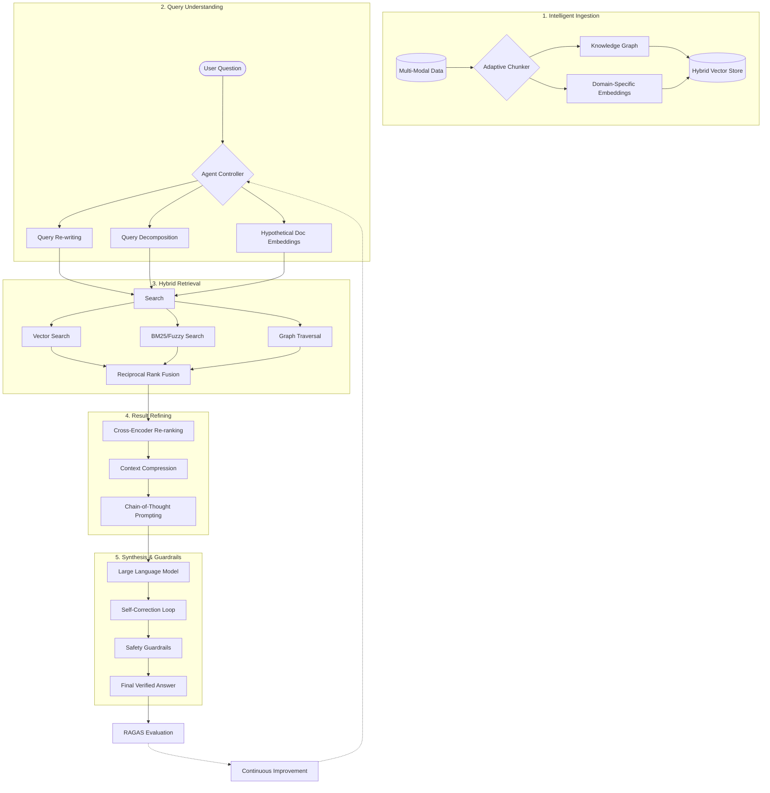

# Node.js RAG Masterclass: 15-Step Comprehensive Guide

A complete, professional-grade learning path for building Retrieval-Augmented Generation (RAG) applications from scratch using **Node.js**, **LangChain**, and **Ollama**.

---

## 🚀 The Learning Journey

This repository is structured as a progressive curriculum. Each step builds on the previous one, taking you from a basic class definition to a state-of-the-art "Master RAG" system.

### 📚 Step-by-Step Tutorials

| Step | Tutorial File | Architectural Notes | Key Concepts |
| :--- | :--- | :--- | :--- |
| **01** | [step-01.js](./step-by-step/step-01.js) | [Chapter 01](./notes/chapter-01.md) | Class Structure & OOP |
| **02** | [step-02.js](./step-by-step/step-02.js) | [Chapter 02](./notes/chapter-02.md) | LLM Initialization (Ollama) |
| **03** | [step-03.js](./step-by-step/step-03.js) | [Chapter 03](./notes/chapter-03.md) | Basic Chat (Invoke API) |
| **04** | [step-04.js](./step-by-step/step-04.js) | [Chapter 04](./notes/chapter-04.md) | PDF Loading & Metadata |
| **05** | [step-05.js](./step-by-step/step-05.js) | [Chapter 05](./notes/chapter-05.md) | Document Splitting (Chunking) |
| **06** | [step-06.js](./step-by-step/step-06.js) | [Chapter 06](./notes/chapter-06.md) | Vectorization & In-Memory Store |
| **07** | [step-07.js](./step-by-step/step-07.js) | [Chapter 07](./notes/chapter-07.md) | Vector Store Retrievers |
| **08** | [step-08.js](./step-by-step/step-08.js) | [Chapter 08](./notes/chapter-08.md) | Retrieval QA Chains (Legacy) |
| **09** | [step-09.js](./step-by-step/step-09.js) | [Chapter 09](./notes/chapter-09.md) | Modern Retrieval Chains (LCEL) |
| **10** | [step-10.js](./step-by-step/step-10.js) | [Chapter 10](./notes/chapter-10.md) | Conversation Memory |
| **11** | [step-11.js](./step-by-step/step-11.js) | [Chapter 11](./notes/chapter-11.md) | Recursive Character Splitting |
| **12** | [step-12.js](./step-by-step/step-12.js) | [Chapter 12](./notes/chapter-12.md) | MMR & Nomic Embeddings |
| **13** | [step-13.js](./step-by-step/step-13.js) | [Chapter 13](./notes/chapter-13.md) | Persistence with ChromaDB |
| **14** | [step-14.js](./step-by-step/step-14.js) | [Chapter 14](./notes/chapter-14.md) | Hybrid Search & Streaming |
| **15** | [step-15.js](./step-by-step/step-15.js) | [Chapter 15](./notes/chapter-15.md) | **Master RAG: Self-Correction** |

---

## 🛠️ Tech Stack & Requirements

- **Runtime**: Node.js (v20+ recommended)
- **Framework**: [LangChain.js v0.3+](https://js.langchain.com/)
- **Local LLM Engine**: [Ollama](https://ollama.com/)
- **Models Used**:
  - `llama3.1:latest` (Generation)
  - `nomic-embed-text:latest` (Embeddings)
  - `all-minilm:latest` (Lightweight Embeddings)
- **Vector Database**: [ChromaDB](https://docs.trychroma.com/) (Step 13+)

---

## ⚙️ Installation & Setup

1. **Clone the Repo**:
   ```bash
   git clone https://github.com/sameerbagul/playwithrag.git
   cd LangChain-RAG
   ```

2. **Install Dependencies**:
   ```bash
   npm install
   ```

3. **Install Ollama Models**:
   ```bash
   ollama pull llama3.1
   ollama pull nomic-embed-text
   ```

4. **Run any step**:
   ```bash
   node step-by-step/step-01.js
   # ... or run the final masterpiece ...
   node step-by-step/step-15.js
   ```

---

## 🧠 Master Advanced RAG Architecture (The Blueprint)

Professionally engineered RAG systems go beyond simple scripts. Here is the architectural lifecycle implemented and explained in this repository:



---

## 📂 Repository Structure

- `step-by-step/`: 15 progressive JavaScript tutorials.
- `notes/`: 15 detailed architectural chapters with Mermaid diagrams.
- `materials/`: Sample data including research papers and documentation sections.
- `assets/`: Architectural diagrams and visual aids.

---

## 🎯 Roadmap

- [x] Migrate to LangChain **v0.3**
- [x] Create 15-step progressive learning path
- [x] Integrate Visual Mermaid Diagrams for all chapters
- [x] Implement Master Features: Hybrid Search & Self-Correction
- [ ] Add Multi-Agent RAG Orchestration (Upcoming)
