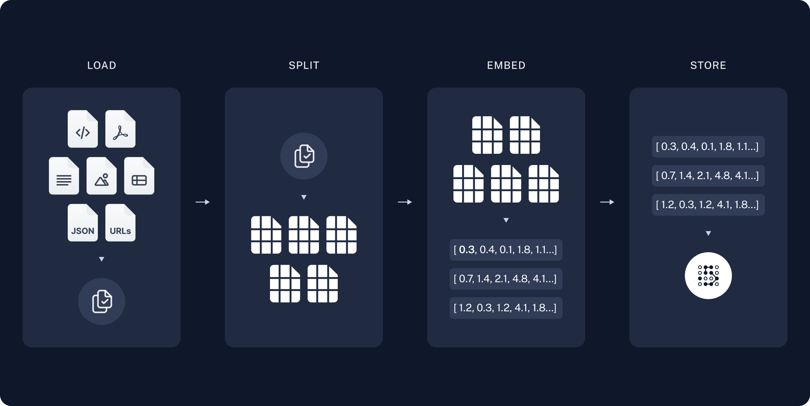
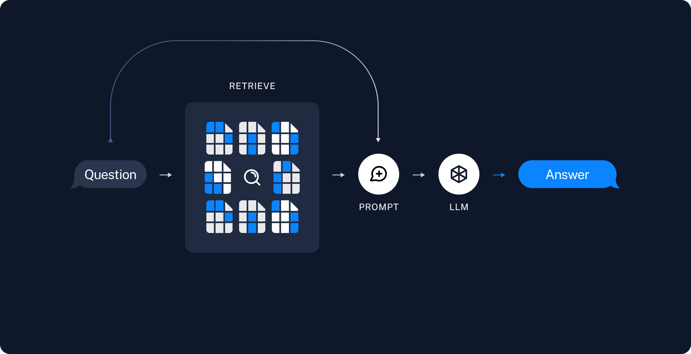

# Simple RAG pipeline using `LangChain.js`

This repository contains the JavaScript version of the python RAG implementation by **Jodie Burchell** using `LangChain` as demoed in her [Beyond the Hype: A Realistic Look at Large Language Models](https://www.youtube.com/watch?v=Pv0cfsastFs) GOTO 2024 presentation.

- [Original repository](https://github.com/t-redactyl/simple-rag-document-qa) (Make sure to star)

- Here's a [detailed tutorial](https://js.langchain.com/v0.2/docs/tutorials/rag) about building a RAG app from the `LangChain` docs.

- Uses `LangChain.js v0.2`

## Prerequisites

If you intend to use a local LLM through Ollama, you will need to install [Ollama](https://ollama.com/) and the [llama3 LLM model](https://ollama.com/library/llama3) via Ollama. You will also need to install the [all-minilm](https://ollama.com/library/all-minilm) embeddings model, also via Ollama.

To ensure that you have successfully downloaded and installed all of the above, run the following commands through your terminal:

- Check whether Ollama is installed: `ollama --version`

- Check whether the required models are available: `ollama list`

## Key differences between the [original python repository](https://github.com/t-redactyl/simple-rag-document-qa/tree/main) and the JavaScript version 

- This is **not** a Jupyter Notebook.

- This code uses two types of Vector stores instead of one. The original code used the `ChromaDB` vector store, whereas this repo contains code using `ChromaDB` but also code using the In-memory vector store module provided by `LangChain.js`.

- The original code used OpenAI's API to connect with a remote LLM. This code uses OpenAI along with Anthropic's Claude and also uses a local LLM powered by Ollama. In this last case, the code uses OllamaEmbeddings which in turn uses the `all-minilm` embeddings model instead of OpenAIEmbeddings.

- The `nDocuments` variable found in the original code has been renamed to `kDocuments`.

- The original code used the `CharacterSplitter` for splitting the PDF documents, whereas this repo contains a variation using the `RecursiveCharacterTextSplitter`.

- The original repo contains a large PDF (pycharm-documentation.pdf which is around 174MB) that is used in the demo. This is a great source to test and also compare the results with the demo, but it turns out that it takes quite a lot of time to get vectorized. For testing purposes and making the process faster of vectorizing faster, especially in the case of the In-memory vector database which gets deleted every time the program gets restarted, a second smaller version of the original file has been added to the `/materials` folder. The file is called `pycharm-documentation-mini.pdf`, it's just 743KB and contains the first 10 pages of the original PDF. 

- Another PDF has been added for further testing. The file can be found in the `/materials` folder and it's named `MetaPrivacyPolicy.pdf`. It's around 4MB and contains the Meta's privacy policy as of 2024.

- Since both the `RetrievalQAChain` (JavaScript version) and `RetrievalQA` (Python version) have been deprecated in the latest versions of LangChain, the final version of the code contains a different implementation that makes it up-to-date and in accordance with the latest specs. Nevertheless, an example using `RetrievalQAChain` can still be found in this repo for an easy comparison between the JS and the Python code as demoed by Jodie Burchell in her presentation.

## Step-by-Step Learning Guide

This repository now includes a structured learning path to help you build the RAG application from the ground up:

* **[Step-by-Step Tutorials](./step-by-step/)**: 14 progressive JavaScript files moving from a simple class to a production-grade RAG pipeline.
* **[Architectural Notes](./notes/INDEX.md)**: Comprehensive documentation for each step, including:
    * **Deep Dives**: Structural and architectural background for every component.
    * **Visual Diagrams**: Mermaid flowcharts, sequence diagrams, and class diagrams for every chapter.
    * **State-of-the-Art Features**: Coverage of Hybrid Search, Streaming, and persistent Vector Databases.

## Usage

- `git clone https://github.com/in-tech-gration/simple-rag-document-qa.git`
- `cd simple-rag-document-qa`
- `npm install`
- **Standard**: `node rag-pdf-qa.js`
- **Advanced (v0.3)**: `cd v0.3 && node extras-step-14.js`

## Repository contents

This repository contains the following material:

**JavaScript Branch:**

* `rag-pdf-qa.js`: The primary code for the standard RAG pipeline.
* `step-by-step/`: Folder containing 14 progressive development steps.
* `notes/`: Detailed architectural notes and visual diagrams for the step-by-step guide.
* `v0.3/`: Advanced implementations using LangChain v0.3 (Hybrid Search, Streaming).
* `talk-materials/talk-sources.md` contains all of the papers and other sources Jodie Burchell used for her talk.
* `talk-materials/beyond-the-hype.pdf` contains a copy of her slides.

## Troubleshooting

- `When I run the script, the code breaks while trying to create the embeddings ('Creating document embeddings...') and the following error message gets displayed: 'input length exceeds maximum context length'`
  - Solution(s): Try switching to an Embeddings model that supports larger input lengths. For example, switching from `all-minilm` to `nomic-embed-test`.

---

The repo contains the following materials for Jodie Burchell's talk delivered at GOTO Amsterdam 2024.

**[Python Branch](https://github.com/in-tech-gration/simple-rag-document-qa/tree/python-original):**

* `/notebooks/rag-pdf-qa.ipynb` contains the code for the simple python RAG pipeline she demoed during the talk. There are extensive notes in Markdown in this notebook to help you understand how to adapt this for your own use case.
* `talk-materials/talk-sources.md` contains all of the papers and other sources she used for her talk. It also contains all of her image credits.
* `talk-materials/beyond-the-hype.pdf` contains a copy of her slides.

## Troubleshooting

- After cloning the repo, installing the dependencies and running `node rag-pdf-qa.js`, the following error is displayed in the terminal:
  > "TypeError [ERR_INVALID_ARG_TYPE]: The "path" argument must be of type string. Received undefined"
  - "This may be related to your Node.js version. The problem was resolved after upgrading from Node 18.17.0 to Node 20.17.0." _(Thanks to @rogerthao588 for sharing this issue with us)_

## Roadmap

- [x] Migrate to version **v0.3** of `LangChain`
- [x] Create step-by-step tutorial files
- [x] Create detailed architectural notes with Mermaid diagrams
- [x] Implement Hybrid Search and Streaming
- [ ] Add Agentic RAG capabilities

---

## Master Advanced RAG Architecture (2025 Best Practices)

While this repository covers the fundamental steps, professional enterprise-grade RAG systems (State-of-the-Art) operate with a much more complex "Modular & Agentic" pipeline. Below is the blueprint of what happens "under the hood" in high-performance AI systems.

### Under the Hood: The Enterprise RAG Lifecycle

```mermaid
flowchart TD
    subgraph Ingestion_Phase [1. Intelligent Ingestion]
        Data[(Multi-Modal Data)] --> Chunker{Adaptive Chunker}
        Chunker --> KG[Knowledge Graph]
        Chunker --> Embed[Domain-Specific Embeddings]
        KG & Embed --> DB[(Hybrid Vector Store)]
    end

    subgraph Pre_Retrieval [2. Query Understanding]
        UserQ([User Question]) --> Agent{Agent Controller}
        Agent --> Rewrite[Query Re-writing]
        Agent --> Decomp[Query Decomposition]
        Agent --> HyDE[Hypothetical Doc Embeddings]
    end

    subgraph Retrieval_Phase [3. Hybrid Retrieval]
        Rewrite & Decomp & HyDE --> Search
        Search --> Semantic[Vector Search]
        Search --> Keyword[BM25/Fuzzy Search]
        Search --> Graph[Graph Traversal]
        Semantic & Keyword & Graph --> RRF[Reciprocal Rank Fusion]
    end

    subgraph Post_Retrieval [4. Result Refining]
        RRF --> Rerank[Cross-Encoder Re-ranking]
        Rerank --> Compress[Context Compression]
        Compress --> Prompt[Chain-of-Thought Prompting]
    end

    subgraph Generation_Phase [5. Synthesis & Guardrails]
        Prompt --> LLM[Large Language Model]
        LLM --> Hallucination[Self-Correction Loop]
        Hallucination --> Guard[Safety Guardrails]
        Guard --> Final[Final Verified Answer]
    end

    Final --> Eval[RAGAS Evaluation]
    Eval -.-> Feedback[Continuous Improvement]
    Feedback -.-> Agent
```

### Advanced Tech & Best Practices
1. **Query Transformation (Pre-Retrieval)**: Instead of searching the raw question, advanced systems rewrite the query to be more "searchable" or generate a "Hypothetical Document" (HyDE) to find actual answers better.
2. **Hybrid & Graph Search**: Combining semantic vectors with keyword search and **Knowledge Graphs** allows the system to understand both "meaning" and "factual relationships."
3. **Cross-Encoder Re-ranking**: Initial retrieval finds 100 docs quickly, but a sophisticated "Re-ranker" evaluates them deeply to pick the top 5, significantly reducing hallucinations.
4. **Context Compression**: Instead of sending full chunks to the LLM, we extract only the relevant sentences to save tokens and improve focus.
5. **Self-Correction & Guardrails**: The model "checks its own work" (Hallucination check) against the source before the user ever sees the answer.
6. **Agentic Loops**: The system isn't a straight line. If the first search fails, an **Agent Controller** decides to search again with a different strategy or ask the user for clarification.
