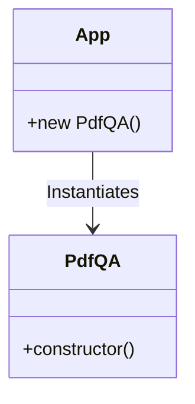

# Chapter 1: Class Definition and Instantiation

In this first step, we establish the foundation of our application using Object-Oriented Programming (OOP) principles in JavaScript.

## Architectural Diagram



## Objects and Classes

The primary structure we use is a class named `PdfQA`. 

- **Class (`PdfQA`)**: A class acts as a blueprint for creating objects. It encapsulates data (properties) and behavior (methods) related to our PDF-based Question Answering system.
- **Constructor (`constructor`)**: This is a special method that runs automatically when a new instance of the class is created. In this initial step, it is empty but serves as a placeholder for future configurations like model names and file paths.
- **Instance (`pdfQa`)**: By calling `new PdfQA()`, we create a concrete object from our blueprint. This object will eventually hold all the state of our RAG application.

## Architectural Background

At the architectural level, using a class allows us to maintain a "stateful" application. Instead of passing variables between functions, we store them as properties of the object (`this.property`). This makes the code modular, reusable, and much easier to scale as we add complex features like vector stores and language models.

## Code Implementation

```javascript
// Define our class
class PdfQA {

  // Define a class constructor
  constructor() {}

}

// Instantiate our class and store the object
const pdfQa = new PdfQA();

// Log our object
console.log({ pdfQa });
```
