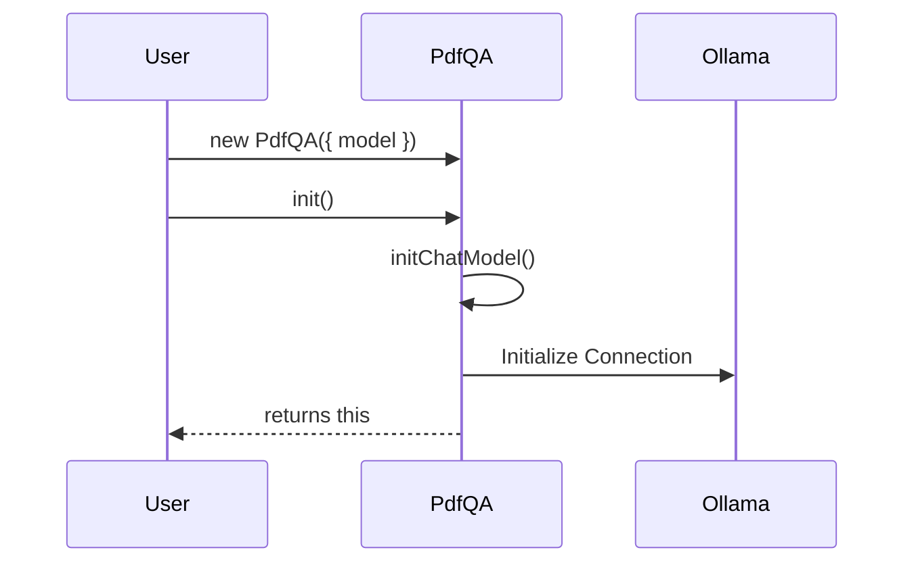

# Chapter 2: Initializing the Language Model

In this step, we integrate the Large Language Model (LLM) into our class structure using the LangChain library and Ollama.

## Architectural Diagram



## Objects and Classes

- **Ollama Class**: Imported from `@langchain/ollama`, this class provides a standard interface to interact with models running locally via Ollama. 
- **LLM Object (`this.llm`)**: When we instantiate `new Ollama()`, we create an object that handles the network communication and protocol required to talk to the local model (e.g., llama3).
- **Initialization Method (`init`)**: We introduce a custom `init()` method. In many async applications, we don't want the constructor to do heavy lifting. Instead, we call `init()` to set up connections.
- **Model Property (`this.model`)**: The constructor now accepts an object with a `model` name, which is stored for later use.

## Architectural Background

The architecture moves from a simple container to a service-oriented structure. By creating `this.llm`, the `PdfQA` object now possesses the "intelligence" to process text. The `init()` method returns `this`, allowing for a "Fluent Interface" pattern (method chaining), which makes the code cleaner.

## Code Implementation

```javascript
import { Ollama } from "@langchain/ollama";

class PdfQA {

  constructor({ model }) {
    this.model = model;
  }

  // Special initializer method
  init(){
    this.initChatModel();
    // Return this to allow method chaining
    return this;
  }

  initChatModel(){
    console.log("Loading model...");
    // The llm object becomes a property of our class instance
    this.llm = new Ollama({ model: this.model });
  }

}

// Chaining .init() after instantiation
const pdfQa = new PdfQA({ model: "llama3" }).init();

console.log({ pdfQa });
```
