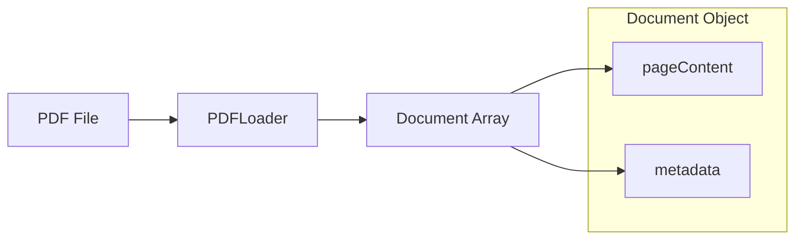

# Chapter 4: Loading PDF Documents

To build a RAG application, we must first be able to "read" external data. This step introduces document loaders.

## Architectural Diagram



## Objects and Classes

- **PDFLoader**: Imported from `@langchain/community/document_loaders/fs/pdf`. This class is responsible for parsing binary PDF data into a format that our application can understand.
- **Document Object**: The result of `loader.load()` is an array of `Document` objects. Each object has two main parts:
    - **`pageContent`**: The actual text extracted from the PDF page.
    - **`metadata`**: Information about the source, like the filename and page number.
- **Path API**: We use `node:path` and `import.meta.dirname` to handle file paths reliably across different operating systems.

## Architectural Background

The architecture now includes a "Data Ingestion" layer. 
1. The `PDFLoader` reads the file from the disk.
2. It uses a library (like `pdf-parse`) under the hood to extract text from the PDF's internal structure.
3. It transforms these pages into an standardized internal LangChain format called `Document`. This standardization is crucial because it allows the rest of our application to work the same way whether we load a PDF, a CSV, or a Website.

## Code Implementation

```javascript
import { Ollama } from "@langchain/ollama";
import { PDFLoader } from "@langchain/community/document_loaders/fs/pdf";
import path from "node:path";

class PdfQA {

  constructor({ model, pdfDocument }) {
    this.model = model;
    this.pdfDocument = pdfDocument;
  }

  async init(){
    this.initChatModel();
    await this.loadDocuments();
    return this;
  }

  initChatModel(){
    this.llm = new Ollama({ model: this.model });
  }

  async loadDocuments(){
    console.log("Loading PDFs...");
    // Creating the loader instance
    const pdfLoader = new PDFLoader(path.join(import.meta.dirname, this.pdfDocument));
    
    // Splitting binary data into a Document array
    this.documents = await pdfLoader.load();
  }

}

const pdfDocument = "../materials/pycharm-documentation-mini.pdf";
const pdfQa = await new PdfQA({ model: "llama3", pdfDocument }).init();

console.log( "Number of pages loaded: ", pdfQa.documents.length );
```
