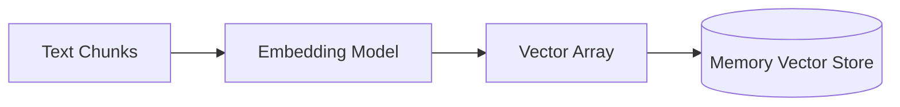

# Chapter 6: Vectorization and Embeddings

To perform a "search" based on meaning (rather than just keywords), we must convert text into numbers. This process is called Vectorization.

## Architectural Diagram



## Objects and Classes

- **OllamaEmbeddings**: This class connects to an embedding model (like `all-minilm`) to transform text chunks into "vectors" (mathematical arrays of numbers).
- **MemoryVectorStore**: This is a simple, "in-memory" database. It stores the text chunks and their corresponding vectors so we can perform similarity searches later.
- **`similaritySearch`**: A method in the vector store that takes a query, converts it to a vector, and finds the closest matching vectors in the store.

## Architectural Background

The architecture now enters the "Embedding & Storage" phase.
1. **Mathematical Mapping**: Every chunk of text is turned into a vector in high-dimensional space. "Dog" and "Puppy" will have vectors that are numerically close to each other.
2. **The Database**: The `MemoryVectorStore` acts as a temporary index. It doesn't save to the disk; it stays in the RAM. This is great for learning but not for large-scale production (which we address in later chapters).

## Code Implementation

```javascript
import { OllamaEmbeddings } from "@langchain/ollama";
import { MemoryVectorStore } from "langchain/vectorstores/memory";

class PdfQA {

  async init(){
    await this.splitDocuments();
    
    // Initialize the embedding model
    this.selectEmbedding = new OllamaEmbeddings({ model: "all-minilm:latest" });
    
    // Create the vector store from the documents
    await this.createVectorStore();
    return this;
  }

  async createVectorStore(){
    console.log("Creating document embeddings...");
    // fromDocuments converts text -> vectors and saves them in the store
    this.db = await MemoryVectorStore.fromDocuments(this.texts, this.selectEmbedding);
  }

}

// Usage: After init, we can search directly
// const results = await pdfQa.db.similaritySearch("How to save files?", 2);
```
