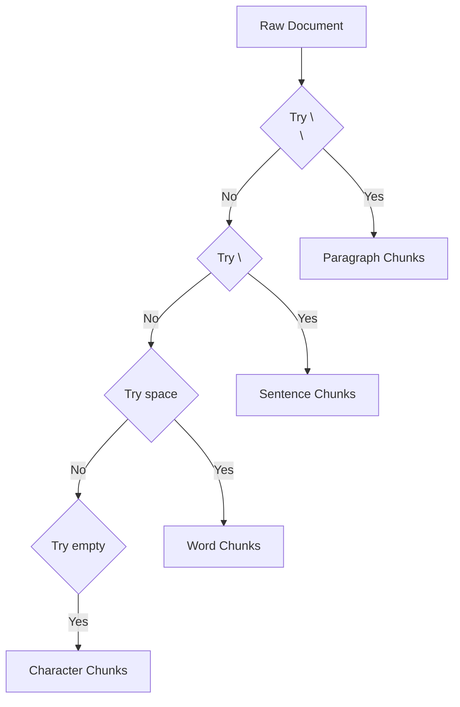

# Chapter 11: Optimization - Recursive Character Splitting

The basic `CharacterTextSplitter` cuts at a fixed point. This can often leave related information in two different chunks. We optimize this with a recursive strategy.

## Architectural Diagram



## Objects and Classes

- **RecursiveCharacterTextSplitter**: This is the recommended text splitter for most use cases.
- **Separators**: Unlike the basic splitter, this one has a list of characters it looks for in order of priority: `["\n\n", "\n", " ", ""]`.

## Architectural Background

The architecture improves the "Semantic Preservation" of the chunks.
1. **Fallback logic**: The splitter first tries to split at double newlines (paragraphs). If a paragraph is too big, it tries single newlines (sentences). If a sentence is too big, it tries spaces (words).
2. **Benefit**: This keeps related sentences together in the same chunk for as long as possible. Better chunks lead to better retrieval, which leads to better answers.

## Code Implementation

```javascript
import { RecursiveCharacterTextSplitter } from "@langchain/textsplitters";

class PdfQA {

  async splitDocuments(){
    console.log("Splitting documents recursively...");
    // This splitter is much more intelligent about finding natural break points
    const textSplitter = new RecursiveCharacterTextSplitter({ 
      chunkSize: this.chunkSize,
      chunkOverlap: this.chunkOverlap 
    });
    
    this.texts = await textSplitter.splitDocuments(this.documents);
  }

}
```
