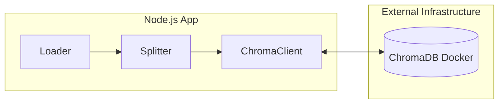

# Chapter 13: Professional Vector Storage - ChromaDB

In-memory storage is not persistent. If you restart the application, you lose your embeddings. This step introduces a real Vector Database.

## Architectural Diagram



## Objects and Classes

- **Chroma**: Imported from `@langchain/community/vectorstores/chroma`. This class allows the application to communicate with a ChromaDB server.
- **`collectionName`**: Like a table in SQL, a collection is a group of related embeddings.
- **Docker**: ChromaDB usually runs as a separate container. This separates the database from the application code.

## Architectural Background

The architecture moves to a "Persistent Data" model.
1. **Decoupling**: The data (vectors) is now stored outside the Node.js process. This means your application can crash or restart without re-parsing the entire PDF every time.
2. **Standardization**: By using the `Chroma` class, we follow the same interface as `MemoryVectorStore`. This proves the power of LangChain's abstractions: we can change the entire database by just changing one class, while the rest of the code stays the same.

## Code Implementation

```javascript
import { Chroma } from "@langchain/community/vectorstores/chroma";

class PdfQA {

  async createVectorStore(){
    if ( this.vectorStoreType === "chroma" ){
      // Connect to the Chroma Server
      this.db = new Chroma(this.selectEmbedding, {
        collectionName: "embeddings-collection",
        url: "http://localhost:8000",
        collectionMetadata: { "hnsw:space": "cosine" },
      });
      // Add documents to the external database
      await this.db.addDocuments(this.texts);
    }
  }

}
```
