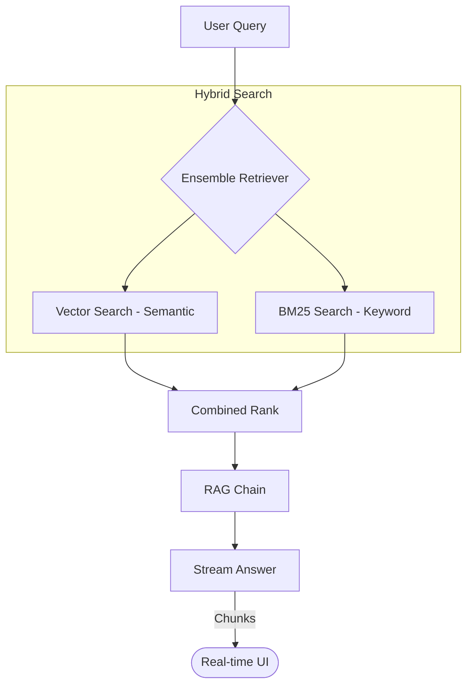

# Chapter 14: State-of-the-Art - Hybrid Search and Streaming

The final step reaches production-grade standards by combining multiple search strategies and improving the user experience with streaming.

## Architectural Diagram



## Objects and Classes

- **BM25Retriever**: A traditional "keyword-based" retriever (like Google Search). It is excellent at finding specific words or product IDs.
- **EnsembleRetriever**: A specialized class that orchestrates multiple retrievers and combines their results into a single list.
- **DirectoryLoader**: Acts as an orchestrator for multiple individual loaders, allowing batch processing of entire folders.
- **`.stream()`**: A method used instead of `.invoke()` to receive the answer piece-by-piece as it is generated.

## Architectural Background

The architecture is now a "Hybrid Retrieval & Streaming" system.
1. **Hybrid Search**: Semantic search is great for meaning, but bad at specific names. Keyword search is great at names but bad at meaning. By using an **Ensemble**, we get the best of both worlds.
2. **Batch Ingestion**: With the `DirectoryLoader`, the architecture moves to "Batch Processing." It scans folders, maps extensions to loaders, and aggregates all pages into a single dataset, making the system highly scalable.
3. **Streaming UX**: Instead of the user waiting for a full paragraph, they see words in real-time. This makes the application feel significantly faster.

## Code Implementation

```javascript
import { BM25Retriever } from "@langchain/community/retrievers/bm25";
import { EnsembleRetriever } from "langchain/retrievers/ensemble";

class AdvancedPdfQA {

  async init() {
    // 1. Vector Retriever (Semantic)
    const vectorRetriever = vectorStore.asRetriever({ k: 4 });

    // 2. BM25 Retriever (Keyword)
    const bm25Retriever = await BM25Retriever.fromDocuments(this.docs, { k: 4 });

    // 3. The Ensemble (Mixing both)
    this.retriever = new EnsembleRetriever({
      retrievers: [vectorRetriever, bm25Retriever],
      weights: [0.5, 0.5],
    });
  }

  async streamAsk(question) {
    const stream = await this.chain.stream({ input: question });
    process.stdout.write(" Response: ");
    for await (const chunk of stream) {
      if (chunk.answer) {
        process.stdout.write(chunk.answer);
      }
    }
  }
}
```
