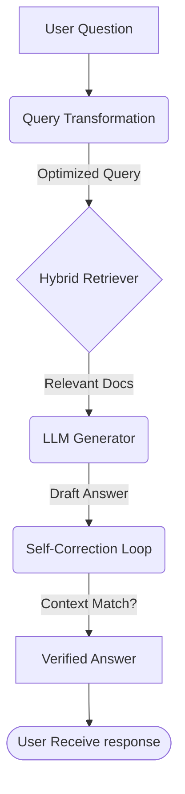

# Chapter 15: The Master RAG - Re-writing and Self-Correction

This final step represents the pinnacle of RAG architecture. It moves from a simple "Search-and-Ask" model to an "Intelligent Orchestration" model.

## Architectural Diagram



## Objects and Classes

- **`rewriteQuery`**: A custom method that uses a second internal LLM call to expand the user's natural language into a technical search query. This significantly improves "Retrieval Recall."
- **`verifyAnswer`**: A "Self-Correction" layer. After the answer is generated, the LLM re-evaluates its own response against the retrieved chunks to ensure every sentence is grounded in the documents (Anti-Hallucination).
- **Orchestration**: Instead of relying on a single LangChain object, we manually orchestrate the flow: Rewrite -> Search -> Generate -> Verify.

## Architectural Background

The architecture is now **Agentic and Self-Correcting**.
1. **Intelligent Retrieval**: By re-writing the query, we overcome the "Search Gap." Users often ask vague questions; the LLM turns them into precise technical queries.
2. **Post-Processing (Refining)**: In standard RAG, if the LLM hallucinates a fact, it goes straight to the user. In Master RAG, the **Self-Correction** loop acts as a "Quality Gate," filtering out any claims that aren't backed by the PDF context.
3. **Enterprise Standard**: This multi-pass logic is how high-end AI systems (like Perplexity or Enterprise Search) ensure accuracy and reliability.

## Code Implementation

```javascript
class MasterPdfQA {
    
    // ... initialization ...

    async masterQuery(userQuestion) {
        // Step 1: Improve the user's search query
        const optimizedQuery = await this.rewriteQuery(userQuestion);

        // Step 2: Perform Hybrid Search and Generate Answer
        const result = await this.ragChain.invoke({ input: optimizedQuery });
        
        // Step 3: Extract context for the verification step
        const contextText = result.context.map(d => d.pageContent).join("\n");

        // Step 4: Verify the answer against the context
        const finalAnswer = await this.verifyAnswer(result.answer, contextText);

        return finalAnswer;
    }
}
```
